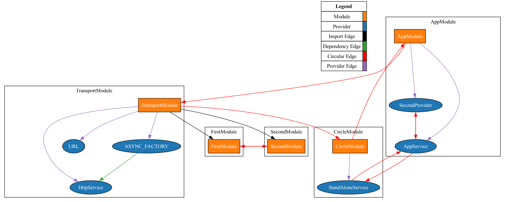

# GraphScannerVisualizer


The GraphScannerVisualizer is a plugin for Nexus IoC that generates visual representations of your module and provider dependency graphs. It uses Graphviz to create a graphical depiction, making it easier to understand and analyze the architecture of your application.

# Features

* Visualize Module and Provider Dependencies: Generate a visual graph of modules and their dependencies.
* Customizable Appearance: Configure colors, shapes, and labels for nodes and edges.
* Highlight Circular Dependencies: Easily spot circular dependencies within your graph.
* Legend for Graph Components: Add a legend to your graph to describe the different components.

# Installation

To use the GraphScannerVisualizer, you need to have Graphviz installed on your system. You can install it via:

```bash
# On macOS
brew install graphviz

# On Ubuntu
sudo apt-get install graphviz

# On Windows
choco install graphviz
```

```bash
npm install nexus-ioc-graph-visualizer
```

# Usage

```typescript
import { GraphScannerVisualizer } from 'nexus-ioc-graph-visualizer';
import { Module, NexusApplicationsServer } from 'nexus-ioc';

@Module({})
class AppModule {}

async function bootstrap() {
  await NexusApplicationsServer.create(AppModule)
    .addScannerPlugin(visualizer)
    .bootstrap();
}

bootstrap();
```

# Configuration Options

The GraphScannerVisualizer accepts an optional configuration object to customize the appearance and behavior of the graph. Below are the configuration options available:

* ranksep: Separation between ranks (default: 1)
* nodesep: Separation between nodes (default: 1)
* moduleColor: Fill color for module nodes (default: #ff7f0e)
* moduleFontColor: Font color for module nodes (default: #ffffff)
* providerColor: Fill color for provider nodes (default: #1f77b4)
* providerFontColor: Font color for provider nodes (default: #ffffff)
* importColor: Color for import edges (default: #d62728)
* dependencyColor: Color for dependency edges (default: #2ca02c)
* circularColor: Color for circular dependency edges (default: #ff0000)
* providerEdgeColor: Color for provider edges (default: #9467bd)
* showLabel: Whether to show labels on edges (default: false)
* showProviders: Whether to show provider nodes (default: true)
* showLegend: Whether to show the legend (default: true)

# Result Example


